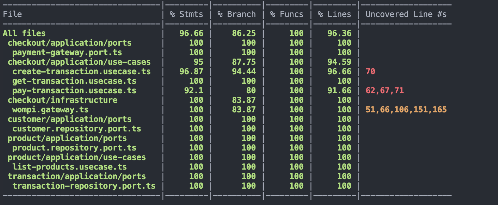

# test-payment

Technical test for Payment using NestJS + TypeORM + PostgreSQL.

## Overview

This project implements a guest checkout flow where customers are identified by email.
The backend follows a ports-and-adapters (clean architecture) style per module, with
entities in `domain`, use cases in `application`, and adapters in `infrastructure`.

## Repository layout

```
backend/payment-backend/   NestJS API (TypeORM + PostgreSQL)
frontend/                Frontend app (if used)
```

The backend lives in `backend/backend`.

## Backend module structure

Each module follows the same structure:

```
modules/<module-name>/
  application/           Use cases and ports (interfaces/tokens)
  domain/entities/       TypeORM entities
  infrastructure/        Adapters (TypeORM repositories, gateways)
  interfaces/            Controllers (HTTP entrypoints)
  <module>.module.ts     Nest module wiring
```

Key modules:
- `product`: products catalog and listing
- `customer`: guest customer info by email
- `transaction`: payment transaction state
- `checkout`: orchestration use cases and payment gateway stub

## Ports & adapters (how dependencies are wired)

Use cases depend on ports (tokens + interfaces). Adapters implement those ports and
are bound inside their modules:

- Product
  - Port: `PRODUCT_REPOSITORY`
  - Adapter: `TypeOrmProductRepository`
- Customer
  - Port: `CUSTOMER_REPOSITORY`
  - Adapter: `TypeOrmCustomerRepository`
- Transaction
  - Port: `TRANSACTION_REPOSITORY`
  - Adapter: `TypeOrmTransactionRepository`
- Payment
  - Port: `PAYMENT_GATEWAY`
  - Adapter: `FakePaymentGateway`

The `CheckoutModule` imports Product/Customer/Transaction modules so their ports are
available to checkout use cases.

## Environment variables

Create a `.env` file in `backend/payment-backend` (same level as `package.json`).
A template exists at `backend/payment-backend/.env.template`.

```
DB_HOST=
DB_PORT=5432
DB_USER=
DB_PASSWORD=
DB_NAME=postgres
DB_SSL=true
DB_SYNCHRONIZE=false
```

Notes:
- `DB_SSL=true` is recommended for RDS.
- `DB_SYNCHRONIZE=true` is for local dev only; do not use in production.

## Running the backend

From `backend/payment-backend`:

```
npm install
npm run start:dev
```

## Seed products

Run the seeder once to populate products:

```
npm run seed:products
```

If products already exist with the same names, the seeder skips them.

## Test endpoints (helper script)

There is a helper script to exercise the main flow:

```
bash scripts/test-endpoints.sh
```

Optional: `BASE_URL=http://localhost:3000 bash scripts/test-endpoints.sh`

## Testing & coverage

Run tests with coverage:

```
npm test -- --coverage
```



## API endpoints

### GET /products
Lists products, including `availableUnits`.

### POST /transactions
Creates a PENDING transaction.

Request body:
```
{
  "productId": "uuid",
  "baseFee": 1000,
  "deliveryFee": 2000,
  "customer": {
    "fullName": "Jane Doe",
    "email": "jane@example.com",
    "phone": "3000000000",
    "address": "Street 123",
    "city": "Bogota",
    "notes": "Leave at door"
  }
}
```

Response:
```
{
  "transactionId": "uuid",
  "status": "PENDING",
  "totalAmount": 1234
}
```

### GET /transactions/:id
Retrieves the transaction state.

### POST /transactions/:id/pay
Simulates a payment:
- Success decreases `product.availableUnits` by 1
- Failure leaves stock unchanged

Request body:
```
{ "success": true }
```

Response:
```
{
  "transactionId": "uuid",
  "status": "SUCCESS",
  "paymentReference": "ref"
}
```

## Checkout flow (high level)

1. Controller calls a use case.
2. Use case uses ports (product, customer, transaction).
3. Ports resolve to TypeORM adapters via module wiring.
4. Payment is simulated using the fake Payment gateway.

This keeps application logic isolated from infrastructure details.
